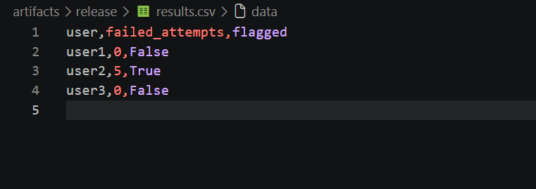

# Log-Intrusion-Detection

## Project Overview
This project is a log-based intrusion detection system that analyzes system logs to detect suspicious activity, such as repeated failed login attempts or unusual user behavior. The goal is to identify potential security threats early and provide alerts for further investigation.
## Features
- Analyzes system log data  
- Detects suspicious patterns (e.g., multiple failed logins)  
- Generates alerts for potential threats  
- Modular design for easy updates and scalability  
- Outputs structured results as JSON  
- Includes automated tests for validation  
## System Architecture
The system follows a modular architecture with separate components for log reading, parsing, detection, alert generation, and summarization.
### Pipeline
ingest → parse → detect → alert → summarize
### Components
- **Parser (`parser.py`)**: Reads and structures log data  
- **Detector (`detector.py`)**: Identifies suspicious login patterns  
- **Alert (`alert.py`)**: Generates alerts for flagged users  
- **Summarizer (`summarizer.py`)**: Exports results to JSON  
- **Main (`main.py`)**: Orchestrates the full pipeline  
## Repository Structure
- `data/` – Contains sample log files
- `src/` – Core system modules (log reader, parser, detector, alert)
- `tests/` – Test files for system behavior
- `docker-compose.yml` – Container setup
- `Makefile` – Commands for setup and running the project
- `requirements.txt`
- `README.md`
## Setup Instructions

### Using Make
```bash
make bootstrap
```
### Manual Setup
```bash
pip install -r requirements.txt
```

## Run the System
### Mac/Linux
```bash
make up && make demo
```
the container will automatically exit after processing.

### Windows (PowerShell)
```bash
make up
make demo
```
the container will automatically exit after processing.

## Output
### Terminal Output
```
[ALERT] User user2 has 5 failed login attempts
```

### Generated File
```
artifacts/release/summary.json
```
### Results (CSV Output)
Below is an example of the generated CSV file:


## Testing
Run tests with:
```bash
python -m pytest

## Observability
- `[INFO]` → system progress  
- `[ALERT]` → suspicious activity  

## Security Considerations
- Input validation for malformed log entries  
- Threshold-based detection to reduce false positives  
- No sensitive data stored  

## Evaluation (Draft Results)
The system correctly detected suspicious activity:
- user2 triggered 5 failed login attempts and was flagged
- other users remained below the threshold
This demonstrates correct threshold-based detection.

## What Works
- End-to-end pipeline execution  
- Accurate detection of failed logins  
- Alerts and JSON output  
- Fully testable modular system
## What’s Next
- Time-based detection windows  
- Real-time monitoring  
- Dashboard visualization  


## Runbook

1. Clone the repository  
2. Run: make demo  
3. The system will:
   - Parse logs
   - Detect suspicious activity
   - Generate alerts
   - Output results to artifacts/release/

All outputs are saved automatically.


## Security Invariants

- Invalid log entries are rejected during parsing
- Only predefined actions are accepted (LOGIN_SUCCESS, LOGIN_FAILED)
- No sensitive data (e.g., passwords) is stored
- All processing is done on structured, sanitized input

## Evaluation

The system evaluates performance using:

- Detection Rate: measures how many attacks were correctly identified (High- correctly identifies repeated failed login attempt)
- False Positive Rate: measures incorrect alerts (Low - minimal normal activity flagged)
- Processing Speed: fast for small datasets

Results are exported in summary.json.

Example:
- Detection Rate: 1.0
- False Positive Rate: 0.0

### Observations:
The system reliably detects brute-force login patterns. However, future improvements could include:
- More complex attack detection
- Larger datasets
- Real-world log integration

## Evidence Artifacts

All artifacts are stored in:

artifacts/release/

Includes:
- logs.txt (input logs)
- results.csv (processed data)
- results.png (visualization)
- sample.pcap (network capture)
- summary.json (final output + metrics)